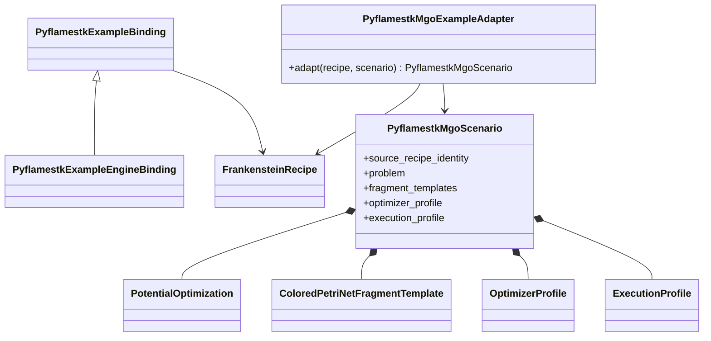
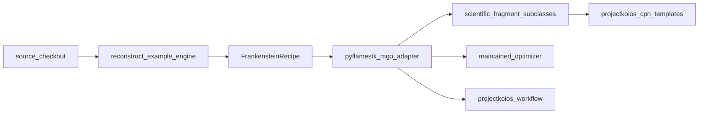

# PyFlamestk MgO examples implementation

**Existing source identity table:**
`sources/pyflamestk.toml` (`selection.example_trees`)

**Existing narrow reconstruction:**
`projectkoios.frankensteins.engines.pyflamestk_lmps_mgo_serial_uniform`

**Proposed binding catalog:**
`projectkoios.frankensteins.engines.pyflamestk_examples`

**Proposed example adapter:**
`projectkoios.frankensteins.examples.pyflamestk_mgo`

The adapter consumes only the maintained reconstruction contract. It must not
import `pyflamestk`, execute a source script, or treat vendored script text as a
runtime module.

The canonical scenario templates are single-candidate evaluation, uniform
sampling, KDE sampling, from-file evaluation, iterative Pareto sampling,
postprocessing, regression replay, and surface-property evaluation. Serial and
MPI variants specialize execution profiles rather than the scientific problem
or CPN fragment semantics.

## Source-example coverage

| Source family | Current Frankenstein boundary | Target treatment |
|---|---|---|
| `MgO_buckingham/lmps_MgO_*` | Exact source-tree identities | Add canonical maintained scenarios |
| `lmps_MgO_mpi_uniform` | Exact source-tree identity | Add uniform scenario with MPI profile |
| `lmps_MgO_pareto_iterate` | Exact source-tree identity | Add iterative Pareto scenario |
| `lmps_MgO_regression_tests` | Exact source-tree identity | Add replay and conformance scenario |
| `lmps_MgO_sample_file` | Exact source-tree identity | Add from-file scenario |
| `lmps_MgO_serial_kde` | Exact source-tree identity | Add KDE scenario |
| `lmps_MgO_serial_uniform` | Narrow maintained reconstruction | Initial complete scenario |
| `lmps_MgO_surface` | Exact source-tree identity; unsupported historical QOI | Remains blocked pending property semantics |
| `lmps_MgO_pareto_calc` | Vendored evidence; no binding | Add non-engine analysis binding and recipe |
| `lmps_MgO_pareto_post` | Vendored evidence; no binding | Add postprocessing binding and recipe |
| `lmps_MgO_sample_post` | Vendored evidence; no binding | Add postprocessing binding and recipe |

Non-engine examples must extend the source-qualified Frankenstein catalog rather
than being mislabeled as calculator engines.
