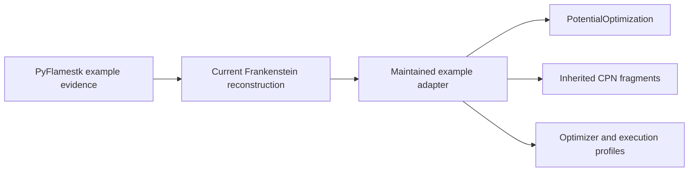

# PyFlamestk MgO worked examples

**Status:** Target examples built from existing Frankenstein reconstructions

The source-qualified PyFlamestk `lmps_MgO_*` trees provide worked scenarios for
the maintained potential-optimization and CPN architecture described
scientifically by [Ragasa et al. (2019)](../../references/ragasa-2019-multi-objective-interatomic-potentials.md).
Historical scripts remain evidence and are never the execution entrypoint.

- [Architecture](architecture/index.md)
- [Implementation](implementation/index.md)
- [Specifications](specifications/index.md)
- [Testing](testing/index.md)
