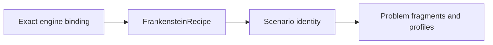

# PyFlamestk MgO examples specifications

- Every worked example **MUST** identify one exact source-qualified PyFlamestk
  binding, repository, commit, tree, example root, and `FrankensteinRecipe`
  identity.
- Non-engine analysis and postprocessing examples **MUST** use dedicated
  Frankenstein binding kinds and **MUST NOT** be mislabeled as engines.
- Adaptation **MUST** consume the maintained reconstruction and **MUST NOT**
  import or execute historical PyFlamestk code.
- Shared potential, structure, material-property, and mathematical-model facts
  **MUST** produce shared maintained definitions when their source evidence is
  identical.
- Distinct source paths with identical trees **MUST** retain path-qualified
  provenance and **MAY** share one scenario template.
- Uniform, KDE, from-file, and iterative behavior **MUST** be represented as
  optimizer profiles, not different scientific problems.
- Serial and MPI behavior **MUST** be execution profiles, not different CPN
  semantics.
- Required material-property simulations **MUST** use inherited scientific CPN
  fragment templates and composition.
- Historical shell, scheduler, executable path, and restart settings **MUST** be
  observations only; current execution requires explicit maintained settings.
- Blocked historical semantics **MUST** remain blocked until a maintained
  material-property definition and conformance evidence exist.
