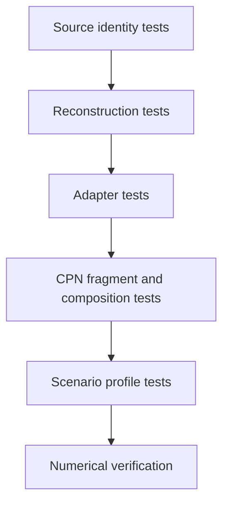

# PyFlamestk MgO examples testing

- Existing reconstruction tests verify source identities, stable recipe
  identities, observed settings, five structures, calculator intents, warnings,
  and closed arithmetic material-property models.
- Adapter tests prove every scenario is derived from a `FrankensteinRecipe` and
  never imports historical PyFlamestk modules.
- Cross-scenario tests prove scientifically identical examples share problem and
  fragment identities while retaining distinct source provenance.
- Profile tests distinguish uniform, KDE, from-file, iterative, serial, and MPI
  policy without changing material-property semantics.
- CPN tests compare composed definitions, initial markings, enabled bindings,
  effect-result correlation, property observations, and visual grouping.
- Regression scenarios use captured artifacts before any external calculator is
  enabled.
- LAMMPS-backed comparisons require explicit executable identity and constitute
  numerical verification, not reconstruction conformance or scientific
  validation.
