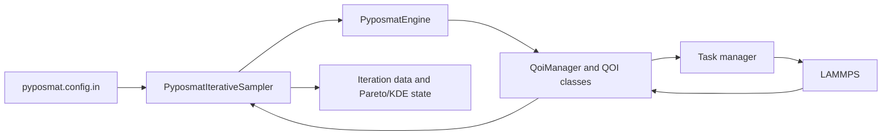
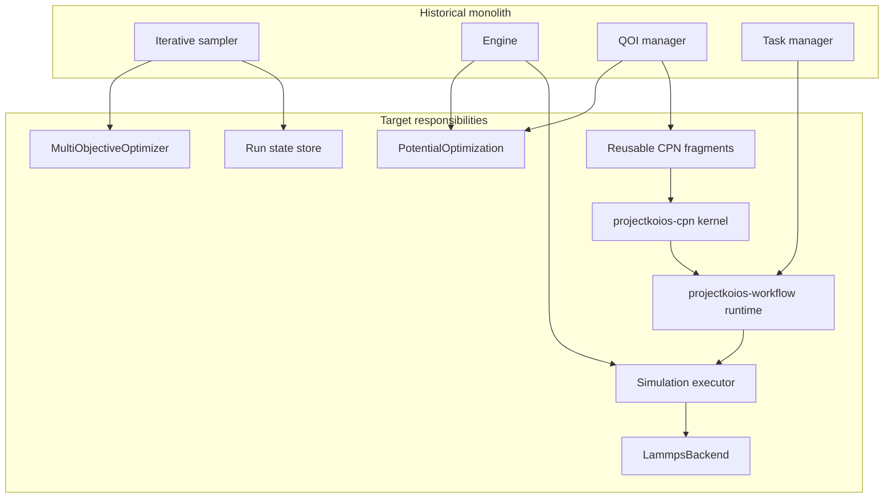
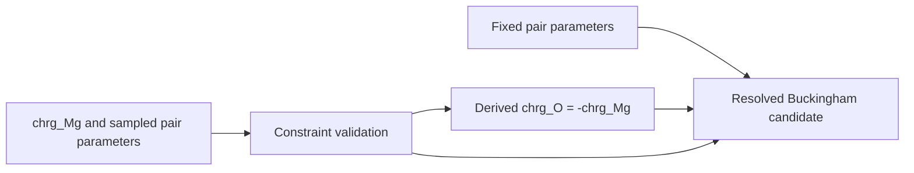
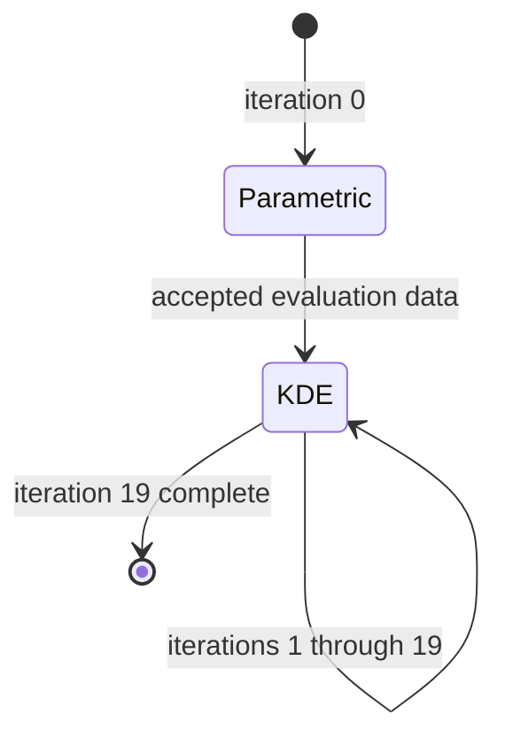
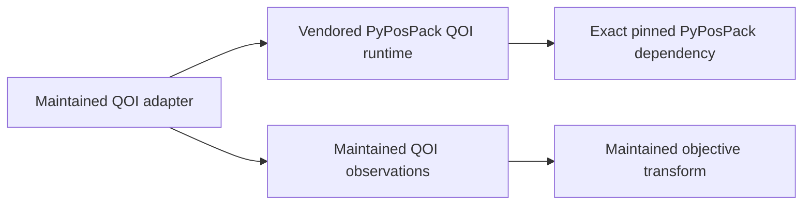
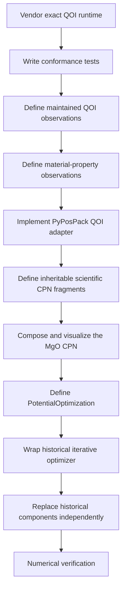

# Historical PyPosPack MgO Buckingham mapping

**Status:** Reconstructed source mapping with a partially implemented adapter

This document maps the pinned PyPosPack MgO Buckingham iterative-sampling
workflow onto the [target potential-optimization architecture](potential-optimization/index.md).
It does not claim numerical verification or scientific validation.

## Source-bound workflow

The representation under `examples/pypospack/MgO/buck/` binds to PyPosPack
commit `be453fa7191e55a0426f66e8b5b5b0b103c8b29d` and Git tree
`7ac9c9f255aa7731f39ce35a0e561fc113082a6f`.

The historical implementation combines optimizer policy, problem definition,
QOI evaluation, task planning, execution orchestration, filesystem state, and
analysis. The target architecture separates those responsibilities.

## Concept mapping

| Historical PyPosPack concept | Target concept | Ownership |
|---|---|---|
| `sampling_type` iteration entries | `IterativeSamplingOptimizer` configuration | Optimizer |
| `parametric`, `kde`, `from_file` | `SamplingStrategy` implementations | Optimizer |
| Pareto filtering | `ParetoSelection` | Optimizer |
| `sampling_dist` | `ParameterSpace` | Problem |
| `sampling_constraints` | Parameter constraints | Problem |
| `potential` | `PotentialModel` | Problem |
| `structures` | `StructureDatabase` | Problem |
| `qois` and targets | Material-property `QuantityOfInterest` definitions | Problem |
| QOI `determine_tasks()` | Inheritable scientific CPN fragment templates | Scientific CPN adapter |
| task dependencies and ordering | Composed CPN definition and marking | `projectkoios-cpn` |
| QOI `calculate_qois()` | Material-property evaluator transition | Problem |
| LAMMPS task classes | CPN effect adapter plus `LammpsBackend` | Integration |
| rank directories | Executor workspace allocation | Execution |
| merged iteration files | Evaluation and checkpoint store | Run state |

## MgO problem definition

The source input defines a Buckingham potential for `Mg` and `O` with eleven
resolved parameters:

- two charges;
- three `Mg-Mg` pair parameters;
- three `Mg-O` pair parameters; and
- three `O-O` pair parameters.

The optimizer independently samples selected parameters. Other parameters are
fixed or derived, including the oxygen charge derived from the magnesium
charge.

The problem uses five structures and ten QOI targets covering lattice geometry,
elastic properties, defect formation energies, and surface energy.

## Iterative optimizer mapping

The historical plan has twenty iterations of one hundred samples:

The maintained optimizer must make the transition criteria, selected data,
kernel state, random state, and checkpoint identity explicit. Directory names
must not be treated as authoritative optimizer state.

## Vendored QOI runtime

The exact historical `pypospack/qoi.py` file and complete `pypospack/qois/`
package are retained under `examples/pypospack/MgO/buck/vendor/`. They serve two
purposes:

1. establish behavioral conformance for task planning and QOI calculation; and
2. expose the historical semantics that maintained adapters must reproduce.

They are not the maintained domain API. The local partial-package adapter uses
`pkgutil.extend_path` so the vendored QOI modules can compose with the exact
pinned PyPosPack dependency while the remaining dependency closure is migrated.
This compatibility mechanism is temporary architecture, not the desired final
boundary.

Vendored files are selected by `VENDORING.toml` and reproduced from committed
Git blobs by `tools/vendor_source_selection.py`. The generated
`PROVENANCE.json` records each source path, Git mode, blob identity, SHA-256,
byte size, and local modification.

## Known historical defects and compatibility decisions

The maintained boundary must not silently preserve known defects:

- `kde_w_clusters` references undefined `_mc_config` and is rejected;
- a `from_file` fallback contains `os.path,join` and must not be reached through
  implicit fallback behavior;
- the sampler's random-seed helper compares rather than assigns in one branch,
  so the adapter assigns the resolved seed explicitly;
- `is_auto` is accepted historically but unused; and
- the historical launcher assigns an ineffective `data_dir` attribute while
  the sampler uses `data_directory`.

Each compatibility decision belongs in an adapter or explicit validation rule,
not as an undocumented mutation of a vendored source file.

## Migration sequence

A historical component is removable only after maintained behavior has explicit
conformance tests against the same source-bound fixtures. Removal does not by
itself establish scientific validation.
