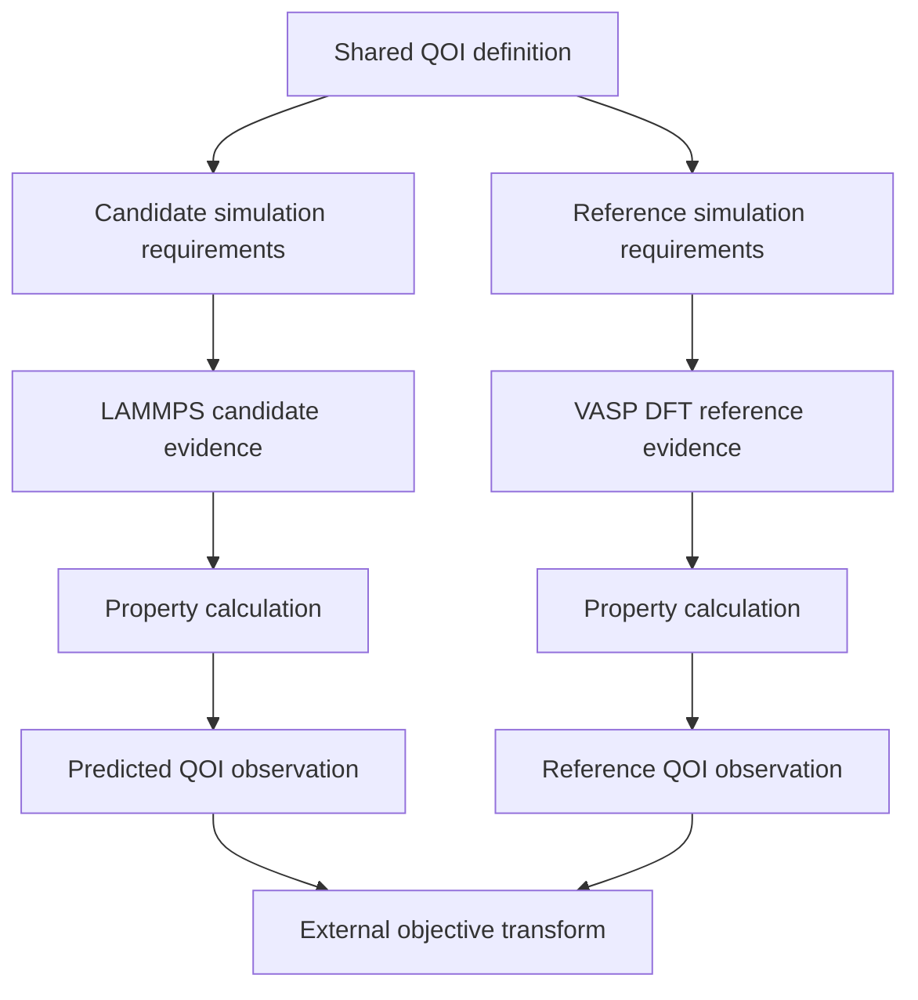

# QOI evaluation architecture

A quantity of interest identifies a material property, required structure roles,
simulation evidence, units, conventions, and the calculation that produces a
normalized observation. It does not contain a reference value or objective
loss.

Candidate and reference paths reuse QOI identity, structure-role semantics,
units, conventions, normalized observation types, and material-property
formulas when scientifically compatible. Their simulation plans and provenance
remain backend-specific.

Reference observations are generated and qualified outside the optimization
loop from a declared high-fidelity source. Candidate observations are generated
inside the loop from the current interatomic potential. The results handler,
not the QOI evaluator, aligns these observations and derives losses.

Observations must be identifiable independently of sources and objective
transforms. Missing or invalid inputs produce explicit failures rather than
fabricated numeric penalties. Units and conventions cannot be inferred from a
field name alone.
