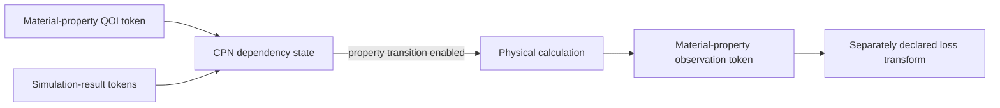

# QOI evaluation architecture

A quantity of interest selects a material property to predict and compare with
a reference target. The problem is to express which evidence makes that property
calculable while retaining units, structure roles, source artifacts, and failure
information.

Evaluation owns the relationship between named structure roles, simulation
outputs, and a physical formula. The scientific adapter expresses that
relationship as CPN places, colors, transitions, and inscriptions. Evaluation
does not own target selection, Pareto filtering, sampling, calculator invocation,
or CPN firing semantics.

Observations must be identifiable independently of targets. Missing or invalid
inputs produce explicit failures rather than fabricated numeric penalties.
Units and conventions are part of the observation definition and cannot be
inferred from a field name alone.
