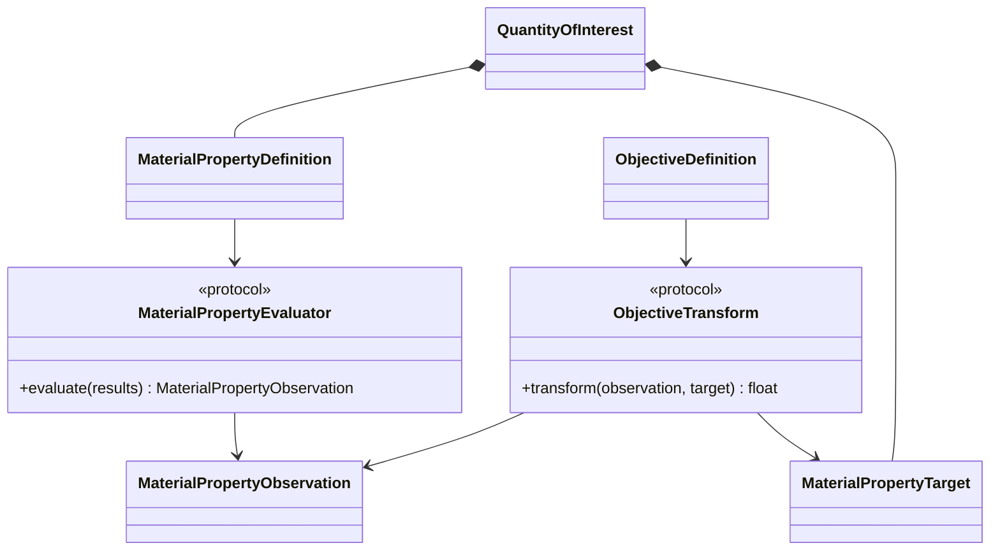
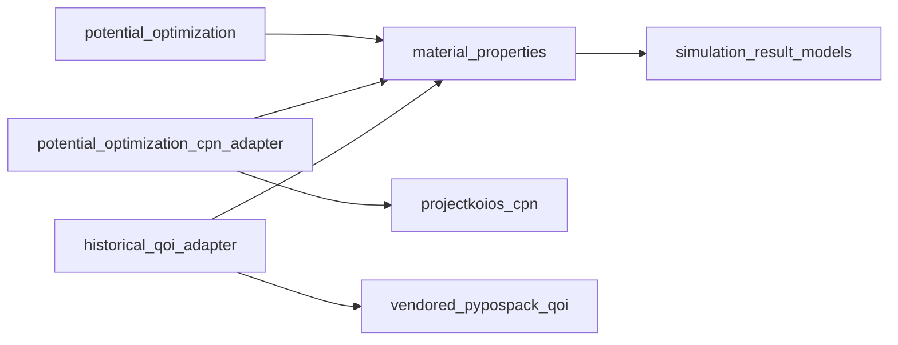

# QOI evaluation implementation

**Proposed package:** `projectkoios.frankensteins.material_properties`

The CPN adapter maps QOI requirements and observations to tokens and transitions.
The historical adapter translates PyPosPack task dictionaries and QOI values.
Maintained material-property models do not import either vendored modules or CPN
implementation details.
