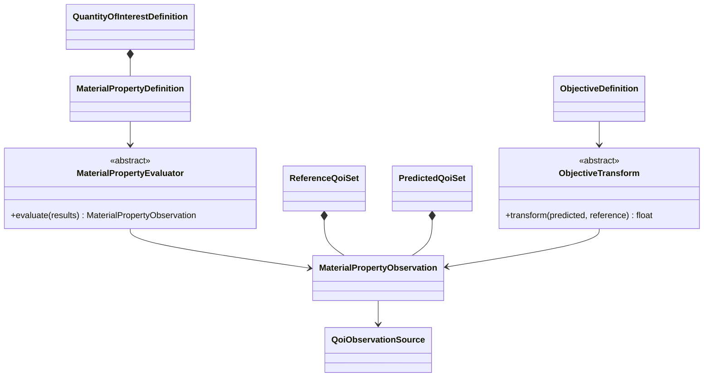
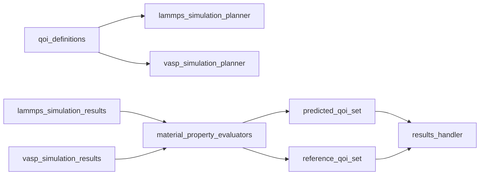

# QOI evaluation implementation

**Proposed package:** `projectkoios.frankensteins.material_properties`

The same maintained property evaluator may consume normalized primitive results
from either backend when the scientific formula is genuinely shared. Backend
adapters remain responsible for parsing and normalizing calculator-specific
artifacts. Every observation retains its source model, backend, structure, task,
artifact, units, and QOI identities.

The CPN adapter maps QOI requirements and observations to tokens and transitions.
Historical adapters translate PyPosPack task dictionaries and QOI values.
Maintained material-property models do not import vendored modules, calculator
integrations, or CPN implementation details.
