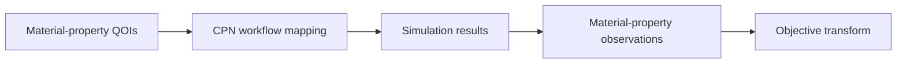

# QOI evaluation

**Status:** Target module

This module turns simulation results into physical observations while preserving
the distinction between observations and optimization losses.

- [Architecture](architecture/index.md)
- [Implementation](implementation/index.md)
- [Specifications](specifications/index.md)
- [Testing](testing/index.md)
