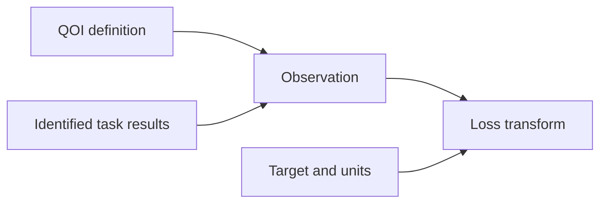

# QOI evaluation specifications

- A QOI **MUST** identify its material-property definition, reference target,
  required structure roles, units, and objective transform.
- Required simulations and property-calculation dependencies **MUST** be mapped
  into the accepted `projectkoios-cpn` model.
- An observation **MUST** retain the QOI identity, numeric value, units, and input
  result identities.
- Evaluators **MUST NOT** invoke calculators, choose optimization targets, or
  implement CPN enablement and firing.
- Missing, non-finite, or incompatible inputs **MUST** produce classified errors.
- Objective definitions **MUST** state target, direction, transform, and any
  normalization or weight.
- A transformed loss **MUST NOT** overwrite its source observation.
- Unit conversion **MUST** be explicit and tested.
- Historical field aliases **MAY** exist only in source-qualified adapters.
