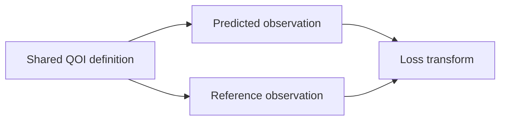

# QOI evaluation specifications

- A QOI definition **MUST** identify its material-property definition, required
  structure roles, units, conventions, and calculation requirements.
- A QOI definition **MUST NOT** embed a reference value or optimizer loss.
- Required simulations and property-calculation dependencies **MUST** be mapped
  into the accepted `projectkoios-cpn` model.
- Candidate and reference simulation planners **MAY** produce different
  backend-specific plans from the same logical QOI requirements.
- An observation **MUST** retain the QOI identity, numeric value, units, source
  model identity, backend identity, structure identity, and input-result
  identities.
- Reference observations **MUST** additionally retain high-fidelity source,
  convergence, qualification, and provenance evidence.
- Candidate and reference observations **MUST** use compatible normalized units
  and conventions before comparison.
- Material-property evaluators **MUST NOT** invoke calculators, select reference
  values, update optimizers, or implement CPN firing semantics.
- Missing, non-finite, or incompatible inputs **MUST** produce classified errors.
- Objective definitions **MUST** state direction, transform, and any
  normalization or weight used to compare predicted and reference observations.
- A transformed loss **MUST NOT** overwrite either source observation.
- Unit conversion **MUST** be explicit and tested.
- Historical field aliases **MAY** exist only in source-qualified adapters.
