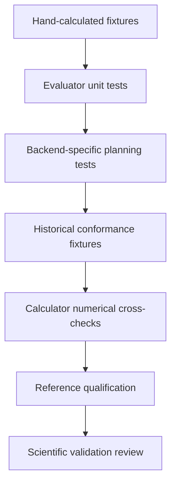

# QOI evaluation testing

- Each QOI has fixtures with explicit units, structure roles, raw result fields,
  and hand-calculated expected values.
- The same QOI definition is tested against compatible normalized primitive
  results from candidate and high-fidelity reference paths.
- LAMMPS and VASP planning tests independently verify the simulation
  requirements compiled for each backend.
- Adversarial tests cover missing fields, non-finite values, role swaps, unit
  mismatches, source mismatches, malformed artifacts, and zero denominators.
- Objective transforms are tested independently from material-property formulas
  and retain both predicted and reference observations.
- CPN tests prove property transitions are enabled exactly when their required
  result tokens are present and shared result tokens are not consumed
  accidentally.
- Conformance tests compare maintained observations with the vendored PyPosPack
  QOI runtime using identical captured task results.
- Calculator reruns, DFT convergence, reference qualification, and scientific
  validation remain distinct from pure QOI unit tests.
