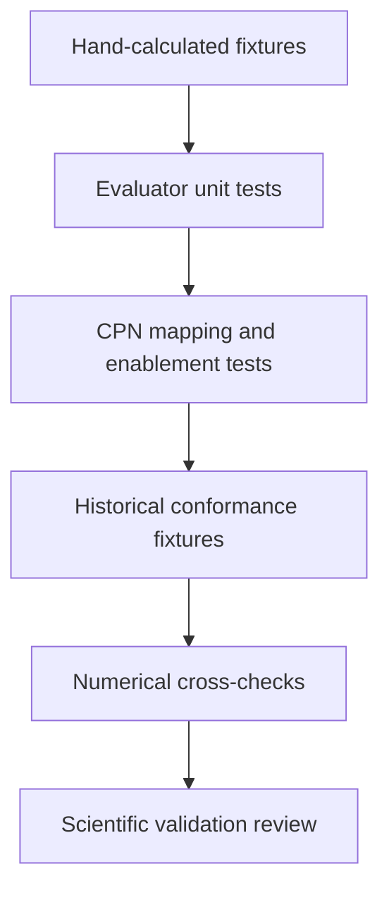

# QOI evaluation testing

- Each QOI has fixtures with explicit units, structure roles, raw result fields,
  and hand-calculated expected values.
- Adversarial tests cover missing fields, non-finite values, role swaps, unit
  mismatches, malformed artifacts, and zero denominators.
- Objective transforms are tested independently from material-property formulas.
- CPN tests prove property transitions are enabled exactly when their required
  result tokens are present and that shared result tokens are not consumed
  accidentally.
- Conformance tests compare maintained observations with the vendored PyPosPack
  QOI runtime using identical captured task results.
- Calculator reruns are numerical verification and are not required for pure QOI
  unit tests.
