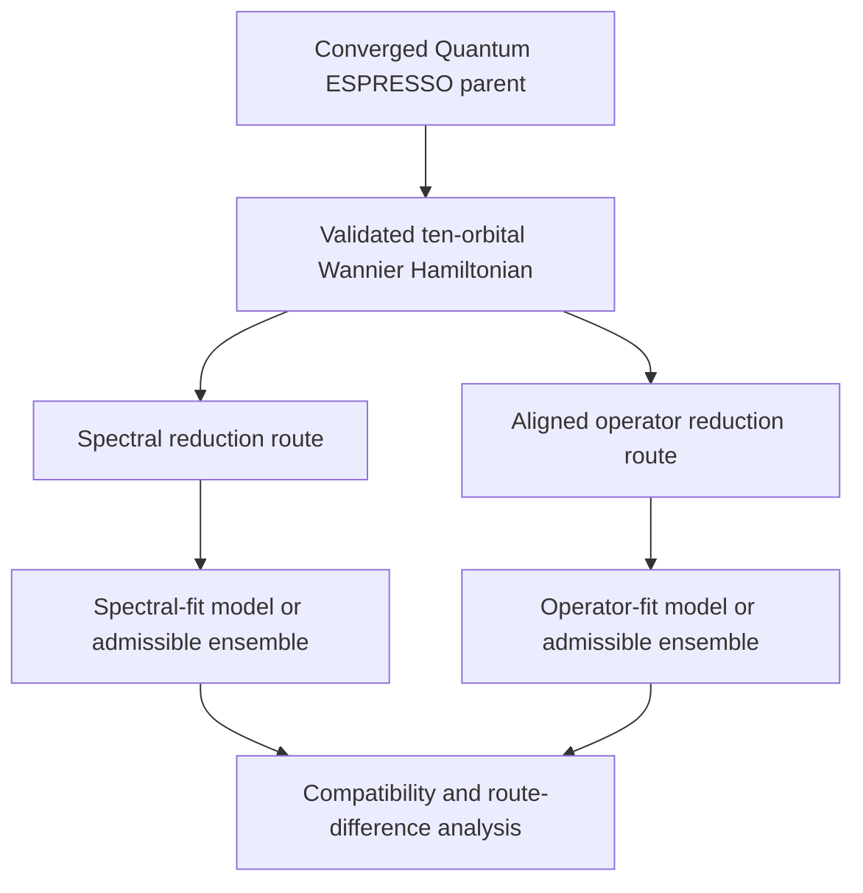
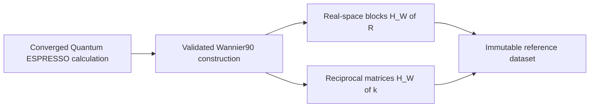
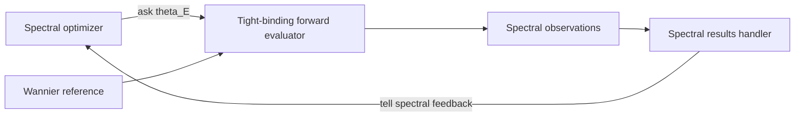
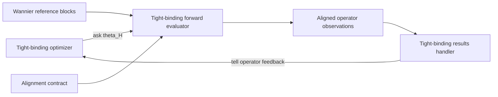

# Reduced-Hamiltonian inverse-problem architecture

## Scientific experiment

The experiment begins with one accepted bulk-silicon Wannier calculation and
then deliberately splits into two reduction routes. The route outputs are not
assumed to be equivalent or compatible. Their differences are the objects of
measurement.



Both routes therefore share one parent Hamiltonian, physical branch, common
canonical comparison space, training/withheld partition, and provenance
lineage. The split changes the reduction objective and may also apply an
explicitly identified route-specific constraint set.

## Shared reference

The high-fidelity parent is generated once, outside fitting:



The reference binds the ten-orbital retained space, lattice and Fourier
conventions, orbital and spin conventions, gauge, energy zero, training and
withheld domains, numerical policy, and source artifacts. Candidate fitting
does not rerun Quantum ESPRESSO or Wannier90.

## Common ambient model and route constraints

Both routes must embed their outputs in one frozen canonical tight-binding
coordinate space. They may use the same feasible parameter domain or two
explicit constrained subdomains of a shared ambient model family:

```text
Theta_spectral subset of Theta_ambient
Theta_tight_binding subset of Theta_ambient.
```

A candidate identifies its route, ambient model class, route constraint set,
and complete immutable free-parameter vector. Constraint resolution constructs
the complete Hamiltonian parameters before evaluation.

The initial ambient class is a spinless ten-orbital orthogonal `sp3s*`
Hamiltonian for diamond silicon. Constraint sets can limit hopping range, tie
parameters by symmetry, fix selected onsite or hopping terms, or admit selected
corrections. Every constraint and later relaxation must be frozen before
results are inspected.

The constructor maps resolved parameters to reciprocal-space matrices
`H_TB(k; theta)` and real-space blocks `H_TB(R; theta)`. Hermiticity, orbital
ordering, lattice convention, symmetry constraints, hopping range, and energy
zero belong to the model contract.

## Spectral reduction route

The spectral optimizer proposes parameter vectors and receives only the frozen
spectral training objective as update feedback:



The forward evaluator constructs `H_TB(k; theta)`, calculates eigenvalues and
band-edge observations, and retains raw outputs. Withheld wavevectors and
band-edge validation values do not update the optimizer.

## Tight-binding operator-fit route

The tight-binding optimizer fits represented Hamiltonian blocks rather than
only their eigenvalues. It proposes parameters under its declared route
constraint set. The route compares candidate real-space blocks with the same
Wannier parent after a declared symmetry-compatible alignment `C`:



A representative loss is

```text
L_H(C, theta) = sum_R omega_R ||H_W(R) - C H_TB(R; theta) C*||_F^2.
```

Alignment is a prerequisite or bounded inner problem, not an unrestricted way
to erase model error. Its direction, group, symmetry, locality, conditioning,
and energy convention must be fixed explicitly.

## Matched and deliberately mismatched controls

Two experiments answer different questions:

1. **Matched-constraint split:** both routes use the same feasible model class,
   so measured differences isolate fitting spectral observations versus fitting
   represented Hamiltonian blocks, subject to optimization error.
2. **Artificially constrained split:** route-specific subdomains are chosen so
   a known or expected incompatibility can exercise the comparison machinery.
   This is controlled software and numerical-verification evidence.

A difference observed under route-specific constraints cannot be attributed to
the fitting objective alone. Constraint identities and their known relationship
must accompany every result.

## Cross-evaluation and measured differences

Every retained route candidate should be evaluated under both criteria even
though only its route-primary criterion updates its optimizer. This creates the
cross-evaluation matrix:

| Model population | Spectral criterion | Operator criterion |
|---|---|---|
| Spectral-route candidates | primary fitting evidence | cross-evaluation |
| Tight-binding-route candidates | cross-evaluation | primary fitting evidence |

The comparison stage measures, without conflation:

- differences between fitted parameter vectors;
- distance between represented Hamiltonians in common canonical coordinates;
- spectral performance of operator-route models;
- operator performance of spectral-route models;
- residuals by onsite/hopping contribution, orbital block, symmetry channel,
  and neighbor shell;
- intersection of spectral- and operator-admissible candidate sets; and
- bounded estimates of set separation when no common candidate is observed.

A nonzero distance between independently selected best models is a measured
route difference. It does not alone prove that the full admissible sets are
disjoint. Likewise, finite search failure does not certify positive global set
separation.

## Admissible sets and model hierarchy

For each frozen pair of route constraint sets:

```text
A_E = {theta in Theta_spectral : L_E(theta) <= tau_E}
A_H = {theta in Theta_tight_binding : min_C L_H(C, theta) <= tau_H}.
```

Their observed intersection identifies candidates satisfying both declared
criteria. Their measured separation characterizes route incompatibility over
the retained evidence. A certified claim that the mathematical sets are
disjoint requires a valid global lower bound beyond ordinary optimization.

The model-selection question is repeated over the frozen hierarchy. The first
class with an accepted common candidate is the smallest observed compatible
class. If none is found, the valid conclusion is limited to the tested classes,
search domains, and evidence.

## Validation and claim boundary

Withheld validation includes band energies, the indirect gap,
conduction-valley position, longitudinal and transverse electron effective
masses, and declared operator diagnostics. Withheld observations never update
either route optimizer.

Raw observations, route-specific losses, cross-evaluations, Pareto membership,
admissibility, measured route difference, certified incompatibility, and human
scientific acceptance are distinct result kinds. The experiment measures
reduction fidelity relative to the converged PBE/Wannier parent; it does not use
agreement with the experimental silicon band gap as an independent fitting
target.
