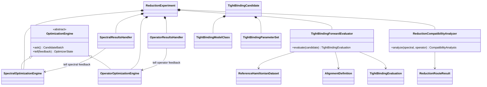

# Reduced-Hamiltonian inverse-problem implementation

The maintained implementation belongs ultimately to `ksdft2effmass`. This
repository reconstructs source behavior, tests transferable boundaries, and
supplies provenance-bound conformance evidence; it does not create a second
application authority.

One `TightBindingForwardEvaluator` computes both spectral and aligned-operator
observations for any candidate. Route-specific handlers select only their
primary training feedback for `tell`, while preserving the other criterion as
cross-evaluation evidence. This avoids giving different numerical
implementations to the two routes.

Each route has independent optimizer state, random state, candidate lineage,
stopping policy, and checkpoint identity. Both receive the identical model-class
and reference identities. A `ReductionRouteResult` contains every candidate,
raw observations, primary feedback, cross-evaluation, failures, and the observed
admissible subset.

`ReductionCompatibilityAnalyzer` is downstream of both fitting routes. It joins
only compatible route results and calculates parameter differences,
Hamiltonian-space distances, cross-performance, observed set intersection, and
bounded sample-set separation. It does not update either optimizer and does not
upgrade a finite observed separation into a certified global result.

A multidimensional initial proposal contains one probability distribution per
free tight-binding parameter. Independent uniform initialization therefore
contains one `UniformProbabilityDistributionParameters` object for every
parameter. Later joint proposal distributions may preserve parameter
correlations, but they remain route-optimizer policy rather than model
semantics.

Existing `ksdft2effmass` represented-operator, QOI, reference-target,
parameter-study, workflow, and provenance records must be adapted rather than
shadowed. Any transfer removes only the `frankensteins` incubation segment when
package ownership has been accepted.
