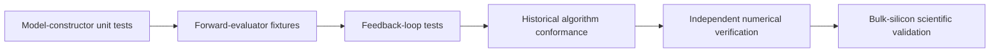

# Reduced-Hamiltonian inverse-problem testing

Software tests use synthetic Hermitian reference blocks with known spectra and
known aligned candidates. They verify parameter admission, model construction,
Hermiticity, symmetry relations, reciprocal/real-space consistency, alignment
direction, spectral observations, operator residuals, and classified failures.

Feedback-loop tests prove that each candidate is evaluated once, full raw
observations are retained, training feedback reaches the proposing optimizer,
and withheld values never affect `tell`. Adversarial fixtures include candidates
with excellent spectra but poor operator residuals and candidates with good
operator residuals but unacceptable band-edge behavior.

Model-hierarchy tests freeze class order and require one exact candidate to
satisfy both criteria. Sampling tests can demonstrate that an intersection is
found in a controlled finite fixture; they cannot prove absence in an unsearched
continuous domain. Certified separation needs independent validated-global-
optimization evidence.

Historical PyPosPack tests support sampler, Pareto, KDE, failure-retention, and
iteration conformance only. They do not validate tight-binding physics.
Production Quantum ESPRESSO/Wannier reference generation, interpolation checks,
withheld silicon observations, sensitivity studies, and scientific conclusions
remain separate authorized work in `ksdft2effmass`.
