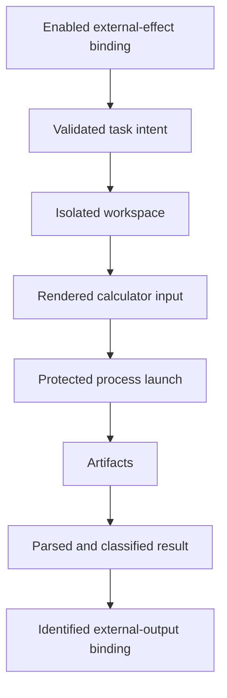

# Simulation execution architecture

Simulation execution crosses the trust boundary from deterministic task intent
to an external calculator. The problem is to grant narrowly scoped process
authority while preserving all inputs, outputs, identities, and failures needed
for review.

Execution begins only after the workflow runtime identifies an enabled
effect-bearing CPN binding. It owns workspace allocation, rendering, launch,
resource limits, artifact capture, result classification, and construction of
the corresponding external-output evidence. It does not choose scientific
parameters, structures, QOI targets, or objective losses.

A successful exit code is not a valid scientific result by itself. Missing
outputs, parser failures, timeouts, signals, and calculator-reported failures
remain distinguishable. Machine paths are operational metadata, not source
provenance.
