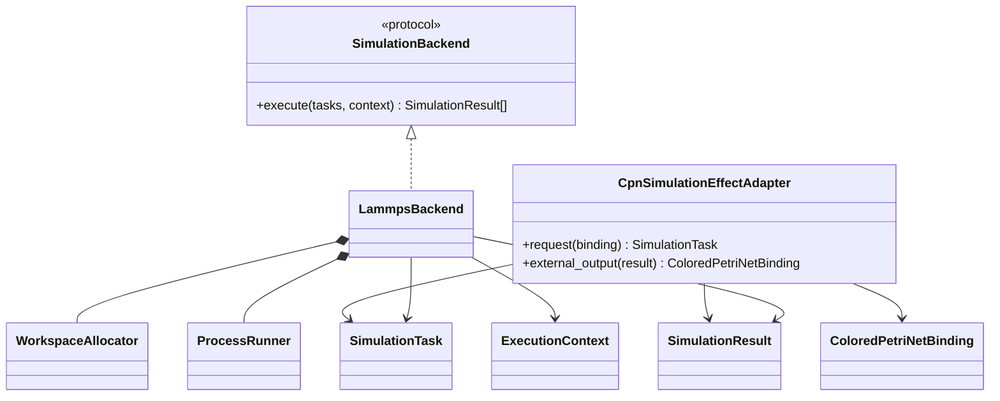
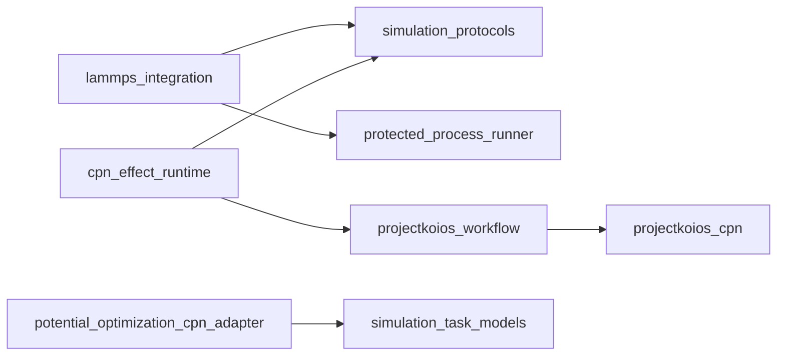

# Simulation execution implementation

**Proposed packages:** `projectkoios.frankensteins.simulation` and
`projectkoios.frankensteins.integrations.lammps`

Only the process runner receives command authority. Renderers and parsers remain
deterministic functions over typed inputs and captured artifacts.
