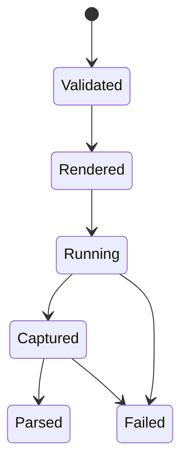

# Simulation execution specifications

- Execution **MUST** require an enabled, selected, and identity-bound CPN effect
  binding, an explicit executable, and an isolated workspace.
- The classified result **MUST** be translated into the exact declared
  external-output binding before pure CPN firing.
- Commands **MUST** be constructed as argument vectors, not interpolated shell
  strings.
- Every task, input, executable, output, and parser **MUST** have a recorded
  identity sufficient for review.
- Timeouts, signals, nonzero exits, missing outputs, malformed outputs, and
  calculator-reported errors **MUST** remain distinct.
- Renderers and parsers **MUST** be deterministic over their declared inputs.
- The backend **MUST NOT** alter scientific candidates or objective definitions.
- Machine paths **MAY** appear in resolved run snapshots but **MUST NOT** replace
  cryptographic source or artifact identities.
- Concurrency **MUST NOT** change result-to-binding correlation, candidate
  association, or successor-marking semantics.
