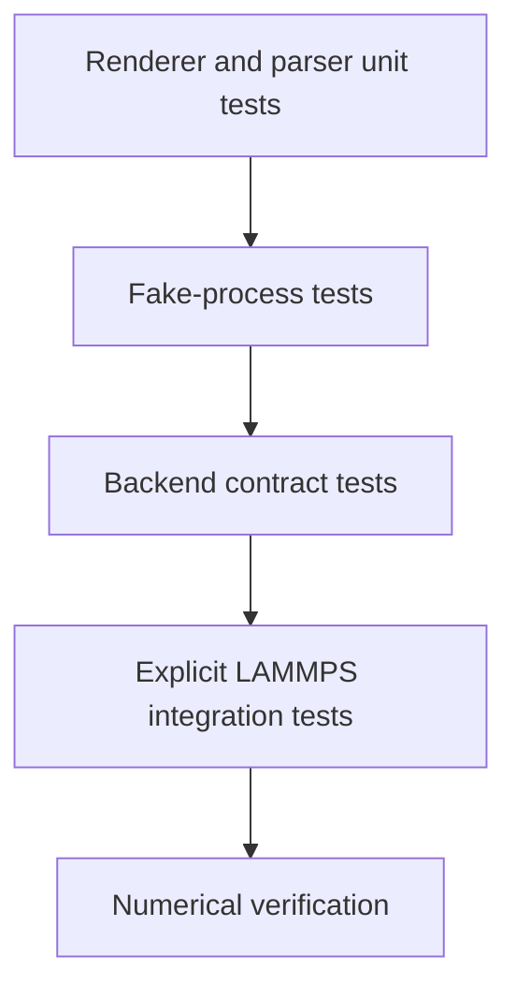

# Simulation execution testing

- Renderers use golden bytes and locale-independent numeric formatting tests.
- Parsers use captured success and failure artifacts without process execution.
- Fake-process tests cover timeout, signal, exit-code, missing-file, and malformed
  output classification.
- Security tests cover path traversal, symlinks, command injection, environment
  leakage, and workspace containment.
- LAMMPS integration tests require an operator-provided executable and recorded
  identity; they are skipped otherwise.
- Numerical verification records version, platform, tolerances, and artifacts.
