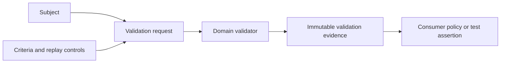

# Validation architecture

Validation converts an explicit subject and criteria into bounded evidence.
Malformed requests and execution failures remain distinct from valid requests
whose subjects fail one or more criteria.

The framework does not define scientific criteria, severity, persistence,
scheduling, or human acceptance. Those remain with the consuming domain.
