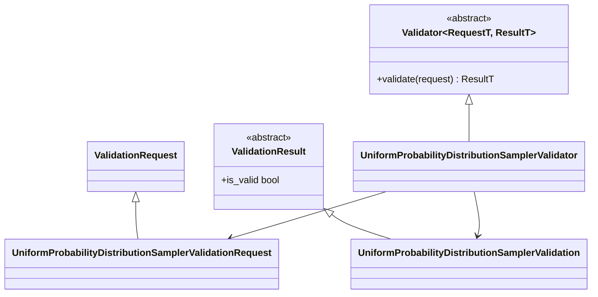

# Validation implementation

The generic bases live in `projectkoios.frankensteins.validation.base`.
Probability-specific request, result, and validator classes remain beside the
probability sampler they validate.
