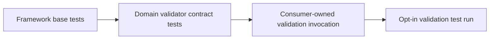

# Validation testing

Fast tests establish nominal inheritance, immutability, malformed-request
handling, and deterministic small-fixture behavior. Longer-running validator
invocations live beside their consuming component, use the `validation` Pytest
marker, and are excluded from default check-in verification.
