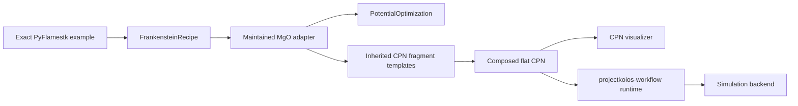
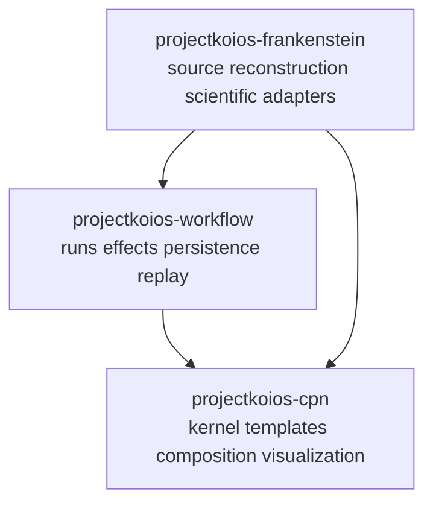

# PyFlamestk MgO on the maintained Frankenstein and CPN architecture

**Status:** Proposed implementation plan

**Primary initial scenario:** `examples/lmps_MgO_serial_uniform`

**Source baseline:** PyFlamestk commit
`5b8368cc88d91bc56f9cc1c8a7fa8d9ea3d6b359`

## Objective

Use the PyFlamestk `lmps_MgO_*` examples as source-qualified worked scenarios
for the maintained Frankenstein architecture. Historical scripts remain
immutable evidence. Every runnable scenario is produced from a reconstructed
`FrankensteinRecipe`, maintained material-property models, inherited reusable
CPN fragment templates, explicit optimizer policy, and explicit execution
policy.

## Ownership boundaries

- `projectkoios-cpn` is the target owner of generic CPN semantics, inheritable
  fragment templates, composition, and visualization.
- `projectkoios-workflow` owns workflow runs, effect coordination, state,
  persistence boundaries, audit, and replay.
- This repository owns source-bound reconstruction, MgO Buckingham problem
  adaptation, material-property semantics, scientific fragment subclasses, and
  scientific visualization annotations.
- The current `projectkoios.workflow.petrinet.colored` package is transfer
  evidence, not the permanent import namespace.

## Design constraints

1. Historical PyFlamestk modules and scripts are never imported or executed.
2. Each scenario begins from an exact source-qualified binding and
   `FrankensteinRecipe` identity.
3. Material-property observations remain separate from reference targets and
   objective losses.
4. Required simulations and their partial ordering are represented by a CPN,
   not a local task graph.
5. Reusable behavior is inherited through fragment templates. Instantiation
   produces immutable fragments that compose into one validated flat CPN.
6. Serial and MPI are execution profiles, not different scientific problems.
7. Uniform, KDE, from-file, and iterative sampling are optimizer profiles, not
   different scientific problems.
8. Reconstruction conformance, numerical verification, and scientific
   validation remain separate claims.

## Milestone 0: Stabilize the maintained Frankenstein baseline

### Deliverables

- Restore or complete the maintained `FrankensteinRecipe`, evidence,
  integration, mathematical-model, and reconstruction modules.
- Make the repository test layout and package facade internally consistent.
- Re-establish full unit, lint, formatting, strict typing, and wheel checks.

### Gate

The maintained reconstruction suite passes without importing or executing an
upstream checkout. Checkout-backed conformance tests pass against exact pins
when explicit checkout variables are supplied.

## Milestone 1: Establish the CPN owner and transfer contract

### Deliverables

- Create the `projectkoios-cpn` package and ownership documentation.
- Transfer the generic CPN kernel from its provenance-bound shadow.
- Publish accepted identities, compatibility policy, and a versioned import
  surface.
- Preserve validation, enablement, deterministic selection, pure firing, and
  audit behavior.
- Define rollback and source-conformance evidence.

### Gate

`projectkoios-cpn` has an accepted contract and release. This repository does
not take a production dependency on the temporary shadow namespace.

## Milestone 2: Add reusable inheritable CPN fragments

### Deliverables

- Define fragment-template identities, inheritance chains, declared extension
  points, typed ports, and immutable fragment instances.
- Implement deterministic namespace assignment and fragment composition.
- Flatten compositions into ordinary validated non-hierarchical CPN definitions.
- Add generic external-effect, simulation-effect, failure, retry, and objective
  aggregation templates.

### Gate

Inheritance substitution, composition determinism, collision rejection, port
compatibility, and behavioral equivalence with independently stated flat nets
are tested.

## Milestone 3: Add CPN visualization

### Deliverables

- Define a read-only view projection over definition, marking, enablement,
  selection, firing audit, and composition evidence.
- Provide deterministic SVG output before an interactive renderer.
- Show topology, token colors and multiplicities, enabled bindings, selected
  binding, consumed/read/inhibited/produced tokens, and fragment boundaries.
- Add scientific annotation adapters without changing CPN identities.

### Gate

Golden views cover concurrency, conflict, shared results, inhibitors, failures,
and firing diffs. Rendering performs no selection, firing, mutation, or effect.

## Milestone 4: Define maintained material-property semantics

### Deliverables

- Define `MaterialPropertyDefinition`, `MaterialPropertyTarget`,
  `MaterialPropertyObservation`, and `QuantityOfInterest`.
- Define the MgO Buckingham parameter space, fixed and derived parameters,
  constraints, five structures, and material-property targets.
- Reconstruct lattice, elastic, defect-formation, and surface-energy formulas
  from exact source evidence.
- Keep raw observations separate from signed, absolute, relative, normalized,
  or weighted objective transforms.

### Gate

Hand-calculated fixtures, unit handling, safe expression evaluation, source
conformance, and failure classification pass without a calculator.

## Milestone 5: Implement the serial-uniform vertical slice

The first complete worked scenario is
`examples/lmps_MgO_serial_uniform` because the current narrow Frankenstein
contract already identifies 29 source files, five structures, four LAMMPS
template families, sampler settings, and mathematical models.

### Deliverables

- Adapt its `FrankensteinRecipe` into one `PotentialOptimization`.
- Instantiate material-property and simulation-effect fragment templates.
- Compose and visualize the exact scenario CPN.
- Represent uniform sampling as optimizer policy.
- Use captured calculator artifacts or a fake backend initially.
- Persist resolved configuration, CPN identities, markings, observations,
  objective losses, and optimizer checkpoints.

### Gate

A one-candidate run completes by deterministic replay without LAMMPS. The
visualizer shows the complete state progression. No source script is imported or
executed.

## Milestone 6: Expand the scenario suite

Implement variants in this order:

| Order | Scenario | Reused science | New policy or behavior |
|---:|---|---|---|
| 1 | serial single-candidate | Complete MgO problem | One explicit candidate |
| 2 | serial uniform | Complete MgO problem | Uniform optimizer profile |
| 3 | sample file | Complete MgO problem | From-file optimizer profile |
| 4 | serial KDE | Complete MgO problem | KDE optimizer profile |
| 5 | serial/pareto iterate | Complete MgO problem | Iteration and Pareto policy |
| 6 | MPI variants | Same problem and CPN | Distributed execution profile |
| 7 | regression examples | Same observations | Captured-result replay |
| 8 | Pareto/sample postprocessing | Recorded evaluations | Analysis-only bindings |
| 9 | surface example | Surface-property subset | Blocked until semantics conform |

### Catalog work

`lmps_MgO_pareto_calc`, `lmps_MgO_pareto_post`, and
`lmps_MgO_sample_post` are retained evidence but are not engine-shaped bindings.
Add dedicated source-qualified analysis/postprocessing binding kinds rather than
mislabeling them as engines.

Content-identical source trees may share a scenario template but must retain
distinct path-qualified provenance.

## Milestone 7: Add PyPosPack as a second source adapter

### Deliverables

- Translate the provenance-bound PyPosPack MgO configuration and QOI runtime
  into the same maintained material-property and potential-optimization models.
- Reuse the same CPN fragment templates wherever semantics agree.
- Record source differences explicitly rather than normalizing them silently.

### Gate

PyFlamestk and PyPosPack adapters produce equal semantic identities where their
problem definitions agree and explicit source-qualified differences elsewhere.

## Milestone 8: Numerical verification

### Deliverables

- Enable an operator-provided LAMMPS executable only through the maintained
  effect boundary.
- Record executable identity, reported version, environment, MPI size, seed,
  input and output artifacts, tolerances, and platform.
- Compare maintained observations with bounded historical references.

### Gate

A reviewed numerical-verification report states exact fixtures, tolerances,
results, and limitations. It does not claim scientific validation.

## Deferred work

- Scientific-validation criteria and acceptance datasets.
- Interactive control surfaces for the visualizer.
- Timed or hierarchical CPN semantics.
- CPN Tools or ISO/IEC 15909-1 compatibility claims.
- Automatic migration of historical result archives.

## Definition of done

This plan is complete when all source-qualified MgO scenarios have an explicit
implemented, aliased, deferred, or blocked disposition; supported scenarios run
through maintained Frankenstein models and accepted CPN/workflow contracts;
visual and replay evidence is available; numerical verification is reported
separately; and no historical script or upstream checkout is used as runtime
code.
