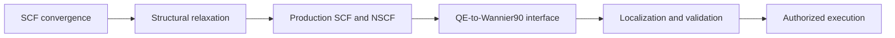

# Plan: silicon bulk Quantum ESPRESSO to Wannier90

**Status:** Active

**Baseline:** `aa0f2bd8ad23d4d2c2f24c236385f05b1d602f9e`

## Goal

Establish one provenance-bound bulk-silicon path from Quantum ESPRESSO numerical convergence through structural relaxation, production SCF and NSCF, QE-to-Wannier90 conversion, Wannier localization, and property-specific validation.

The plan orders independently reviewable slices. Slices consume module-owned tasks and subtasks; this plan does not duplicate their implementation detail.

## Slice order

1. SCF convergence — `slices/bulk-silicon-qe/scf-convergence/`
2. Structural relaxation — `slices/bulk-silicon-qe/structural-relaxation/`
3. Production SCF and NSCF — `slices/bulk-silicon-qe/production-scf-nscf/`
4. QE-to-Wannier90 interface — `slices/bulk-silicon-qe/qe-wannier-interface/`
5. Wannier localization and validation — `slices/bulk-silicon-qe/wannier-localization-validation/`
6. Separately authorized execution — `slices/bulk-silicon-qe/authorized-execution/`

Each implementation slice first reaches its gate through deterministic replay. Execution remains a separately authorized terminal slice.

## Ownership hierarchy

Module tasks are organized independently of this plan:

- Quantum ESPRESSO integration tasks — `tasks/qe/`
- Quantum ESPRESSO workflow tasks — `tasks/workflow/qe/`
- Wannier90 integration tasks — `tasks/wannier/`
- Wannier90 workflow tasks — `tasks/workflow/wannier/`
- Composed bulk workflow task — `tasks/workflow/bulk/qe-wannier90/`

A module task owns reusable behavior. A subtask owns the smallest independently verifiable change. A slice consumes task outputs to demonstrate one end-to-end capability.

## Required decisions

Before their dependent slices can pass, the operator must accept:

- `relax` or `vc-relax` and the force, stress, pressure, cell, step, and termination policy;
- initial silicon structure and handedness treatment;
- exchange-correlation and exact pseudopotential identity;
- spin and spin-orbit treatment;
- pre- and post-relaxation convergence properties, tolerances, increments, and budgets;
- Wannier functions, projections, band count, uniform mesh, frozen window, and outer window;
- validation points, metrics, tolerances, and energy-alignment policy; and
- exact QE, `pw2wannier90.x`, and Wannier90 executable identities.

The current proposal is `vc-relax` for an equilibrium bulk-silicon lattice. It remains a proposal until its complete numerical policy is accepted.

## Plan-wide constraints

- Reuse the maintained `dft_pw_scf` child rather than redefining single-SCF behavior.
- Add abstractions only after concrete tasks demonstrate repeated semantics.
- Preserve calculator-native artifacts before normalization.
- Keep mutable calculator state and large artifacts outside Petri-net markings.
- Keep operational retry separate from scientific extension.
- Give every child and composed workflow an explicit start and exactly one terminal outcome.
- Keep executable paths, workspaces, timeouts, and resources in operator-local configuration.
- Never execute calculator or historical source code without explicit authorization.
- Distinguish reconstruction conformance, numerical verification, scientific validation, and publication authorization.

## Extension to dopants

After the bulk slices pass, a dopant plan may prepend explicit supercell and substitution declarations and consume the accepted relaxation, SCF, NSCF, interface, localization, and validation tasks.

Charged defects remain separately blocked on accepted chemical-potential, Fermi-level, electrostatic-correction, dielectric, and supercell-convergence policies.

## Non-goals

This plan does not:

- implement dopant or charged-defect calculations;
- authorize QE, `pw2wannier90.x`, or Wannier90 execution;
- implement ABINIT or VASP equivalents;
- establish cross-calculator energy or basis equivalence;
- infer projections, windows, spin, symmetry, or tolerances; or
- claim that total-energy convergence establishes force, band, or Wannier convergence.

## Completion

The plan closes only after every slice has a terminal disposition, the complete path is verified by replay, one separately authorized execution retains exact native evidence, validation reports only claims supported by accepted policies, and unresolved limitations are recorded.
