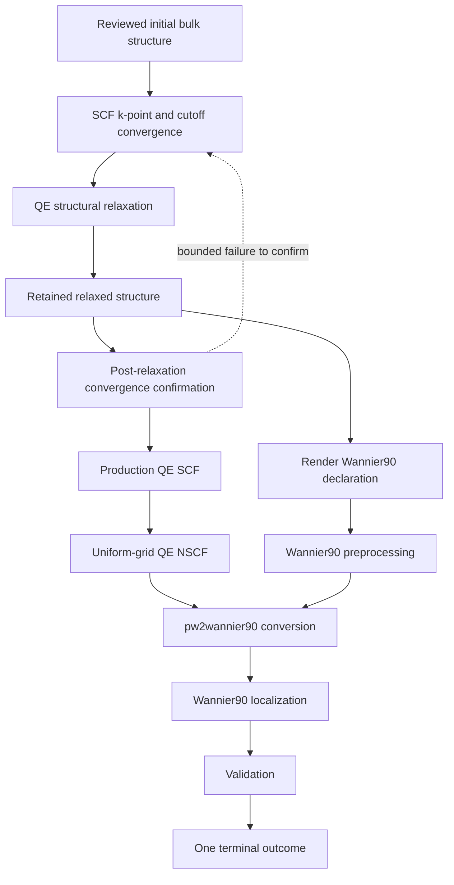

# Silicon bulk Quantum ESPRESSO to Wannier90 vertical slice

**Status:** Active planning; implementation has not started

**Baseline:** `aa0f2bd8ad23d4d2c2f24c236385f05b1d602f9e`

**Initial scope:** Bulk silicon with Quantum ESPRESSO, `pw2wannier90.x`, and Wannier90

## Purpose

Build one working, provenance-bound electronic-structure path before extracting a broader architecture. The implementation extends the maintained calculator-neutral SCF workflow only where the vertical slice demonstrates a concrete missing boundary.

The first slice performs bounded SCF convergence, structural relaxation, a production SCF calculation, a uniform-grid NSCF calculation, QE-to-Wannier90 conversion, Wannier localization, and validation. Dopants and additional calculators follow only after this path exposes stable reusable seams.

This plan does not authorize calculator execution, select machine-local resources, establish scientific validity, or claim that the proposed stages are implemented.

## Workflow



The NSCF branch and Wannier90 preprocessing branch share the same reviewed Wannier k-point declaration. They may proceed independently after the relaxed structure and k-point declaration are accepted. `pw2wannier90.x` is enabled only after both branches provide their required artifacts.

## Stage boundaries

| Stage | Scientific input | Required output | Native evidence |
|---|---|---|---|
| Initial structure | Reviewed silicon unit-cell identity | Structure reference | Serialized structure bytes and identity |
| SCF convergence | Initial structure, pseudopotential identity, convergence policy | Accepted k-point and cutoff settings or bounded exhaustion | Every SCF input, output, execution record, parsed native observation, and assessment |
| Structural relaxation | Initial structure and accepted numerical settings | Relaxed structure or terminal failure | QE input/output, execution record, force/stress and convergence observations, final cell and basis |
| Post-relaxation confirmation | Relaxed structure, accepted settings, neighboring coordinates, confirmation policy | Confirmed settings, bounded return to convergence, or terminal failure | Confirmation calculations and assessment |
| Production SCF | Relaxed structure and confirmed settings | Completed converged SCF reference and identified QE saved state | Input, stdout, stderr, execution record, saved-state manifest, and hashes |
| Uniform-grid NSCF | Production SCF reference, Wannier k-point declaration, band count | Completed NSCF saved state | Input, stdout, stderr, execution record, saved-state manifest, and hashes |
| Wannier90 preprocessing | Reviewed `.win` declaration | `.nnkp` artifact or terminal failure | Executable identity, input, captured streams, output identity, and hashes |
| QE conversion | NSCF saved state, `.nnkp`, and reviewed converter input | Required Wannier interface artifacts | `pw2wannier90.x` executable identity, input, captured streams, and `.amn`/`.mmn`/`.eig` identities where produced |
| Wannier localization | Reviewed `.win` plus converter artifacts | Completed Wannier result | Wannier90 executable identity, `.wout`, centers/spreads, `_hr.dat` and other declared outputs |
| Validation | Native DFT and Wannier results plus an accepted policy | Qualified validation result or terminal failure | Compared bands, metrics, tolerances, diagnostics, and source-artifact identities |

Native artifacts are preserved before normalization. A normalized observation never replaces the calculator-native value or its artifact identity.

## Work-driven ownership

### Reuse now

The maintained `applications/pw_dft_scf/` child workflow remains the owner of a single SCF calculation. K-point, cutoff, and joint convergence continue to compose that child through calculator-neutral recipes, policies, handlers, and assessments.

### Add only when required

The vertical slice requires distinct behavior for:

- QE structural relaxation;
- uniform-grid NSCF;
- Wannier90 preprocessing and localization;
- the QE-specific `pw2wannier90.x` bridge; and
- validation of Wannier interpolation against identified DFT evidence.

These stages begin as narrow application and integration modules. Shared bases are extracted only after at least two concrete implementations demonstrate the same semantics.

### Keep external

Workspace allocation, executable resolution, pseudopotential resolution, process launch, timeout, retry, persistence, and artifact storage remain outside pure scientific transitions. Workflow markings carry immutable identifiers and small control tokens rather than mutable simulations or large native artifacts.

## Convergence and relaxation

### Pre-relaxation convergence

SCF convergence establishes numerical settings on the reviewed initial structure. K-point and wavefunction-cutoff scans may begin independently, but acceptance requires a joint confirmation because each axis is assessed while holding the other coordinate finite.

The initial convergence property is total energy per atom. That result does not establish force, stress, band-edge, NSCF, Wannier, or dopant convergence.

### Structural relaxation

The operator must choose one QE calculation role before implementation:

- `relax` for atomic positions at fixed cell; or
- `vc-relax` for atomic positions and cell degrees of freedom.

The proposed default for an equilibrium bulk-silicon lattice is `vc-relax`. Acceptance still requires explicit force, stress, pressure, cell-dynamics, symmetry, maximum-step, and termination policies.

The final cell and atomic basis become a new immutable structure record linked to the initial structure and exact relaxation evidence. They are not written back into the original declaration.

### Post-relaxation confirmation

The relaxed structure is evaluated at the accepted coordinate and at policy-declared neighboring coordinates. Failure to confirm may request a bounded convergence extension and, if scientifically required, one new relaxation cycle. The policy must cap confirmation cycles, coordinate extensions, calculator jobs, and retries. Operational retry remains separate from scientific extension.

## Production SCF and NSCF

The production SCF is a new identified calculation on the accepted relaxed structure. It does not reuse an arbitrary convergence workspace as authoritative state.

The NSCF calculation must use:

- the same accepted structure and pseudopotential identities as the production SCF;
- an explicitly declared uniform k-point set compatible with the Wannier declaration;
- an explicit band count justified by the target Wannier subspace and disentanglement policy; and
- a separately identified QE saved-state input/output boundary.

SCF k-point convergence does not automatically establish that the Wannier interpolation mesh is sufficient. Wannier-mesh validation is a later property-specific policy.

## Wannier90 and QE bridge

Wannier90-native declarations and results belong under `integrations/wannier90/`. QE-specific conversion behavior belongs under the QE integration because `pw2wannier90.x` consumes QE-native saved-state artifacts.

The maintained implementation must distinguish at least:

1. rendering the reviewed `.win` declaration;
2. running `wannier90.x -pp` and retaining `.nnkp`;
3. rendering and running `pw2wannier90.x`;
4. retaining produced interface artifacts by role and hash;
5. running `wannier90.x` localization; and
6. parsing `.wout` and declared derived artifacts without discarding raw evidence.

Exact supported file families and version/build contracts are specified before each parser is implemented. Unsupported native files receive typed declarations and explicit `NotImplementedError` boundaries rather than speculative parsing.

## Validation

Validation is property-specific and must not collapse to process success. The first accepted policy should separately assess:

- QE SCF, NSCF, converter, and Wannier90 completion;
- convergence and blocking diagnostics;
- requested versus reported numbers of bands and Wannier functions;
- final and change-in-spread observations;
- disentanglement-window behavior when disentanglement is enabled;
- maximum and root-mean-square DFT-versus-Wannier band differences over a declared energy window and independent validation k points; and
- presence and identity of every artifact required by the accepted result.

Thresholds, energy windows, projections, frozen windows, validation paths, and publication claims remain human-owned scientific decisions. A successful workflow run is not by itself numerical verification or scientific validation.

## Evidence and replay

Every external stage records:

- stable task and correlation identifiers;
- calculator or tool integration identifier;
- executable path in operator-local configuration and executable cryptographic identity in evidence;
- reported version/build metadata;
- pseudopotential filename, family declaration, and cryptographic identity;
- bounded command arguments with no shell;
- working-directory identity in execution evidence rather than scientific records;
- input and output artifact roles, byte counts, and hashes;
- captured standard streams;
- return status, timeout, and failure classification; and
- parser and normalization outcomes.

Replay handlers consume retained artifacts through the same scientific workflow boundaries. Mock handlers may test control behavior but are never presented as retained scientific evidence.

## Failure and terminal outcomes

Each child and parent workflow has an explicit start boundary and exactly one terminal-outcome token. Terminal outcomes distinguish at least:

- accepted completion;
- numerical-policy exhaustion;
- structural-relaxation failure;
- SCF or NSCF failure;
- preprocessing failure;
- QE conversion failure;
- Wannier localization failure;
- validation failure; and
- infrastructure failure.

A successful earlier stage remains retained when a later stage fails. Corrections produce new identified requests. No failure handler overwrites prior evidence or silently authorizes another execution.

## Implementation sequence

### Milestone 0: Accept the bounded declarations

Decide and record:

- `relax` or `vc-relax` and its termination policy;
- initial structure and handedness treatment;
- exchange-correlation and pseudopotential identities;
- pre- and post-relaxation convergence policies;
- spin and spin-orbit treatment;
- target Wannier functions and initial projections;
- number of bands and k-point mesh declaration;
- disentanglement and frozen-window policy;
- validation metrics and tolerances; and
- exact QE, `pw2wannier90.x`, and Wannier90 executable identities.

**Gate:** every unresolved scientific choice is either accepted or explicitly blocks its dependent stage.

### Milestone 1: Preserve the existing SCF/convergence child

Use replay evidence to demonstrate convergence orchestration and accepted-setting output without changing the semantics of `dft_pw_scf`.

**Gate:** retained evidence, mock evidence, and generated demonstration data are distinguishable; every accepted setting cites its policy and native artifacts.

### Milestone 2: Implement QE structural relaxation

Add the narrow action/result, QE projection, output analysis, handler, immutable relaxed-structure result, and replay tests required by the accepted relaxation role.

**Gate:** replay produces an identified relaxed structure or one explicit failure outcome without mutating the initial structure.

### Milestone 3: Implement post-relaxation confirmation and production SCF

Confirm numerical settings on the relaxed structure and create a clean production SCF reference.

**Gate:** bounded extension and exhaustion behavior are tested; production SCF evidence is independent from convergence workspaces.

### Milestone 4: Implement uniform-grid QE NSCF

Add the minimum NSCF contracts, projection, output analysis, saved-state manifest, and replay behavior required by Wannier90.

**Gate:** the NSCF k-point declaration and band count are explicit and correlated with the production SCF and planned Wannier subspace.

### Milestone 5: Implement Wannier90 preprocessing and QE conversion

Add reviewed `.win` and converter-input projection, external handlers, required native artifact declarations, and replay fixtures.

**Gate:** `.nnkp` and converter artifacts are joined by identity; missing, mismatched, oversized, or malformed artifacts fail closed.

### Milestone 6: Implement localization and validation

Add bounded `.wout` observations, declared derived outputs, and property-specific comparison with independent DFT evidence.

**Gate:** replay reaches one qualified terminal outcome and reports validation metrics without claiming scientific acceptance beyond the declared policy.

### Milestone 7: Perform an authorized bulk-silicon run

Only after explicit operator authorization, resolve local resources and run the accepted sequence under bounded execution policy.

**Gate:** exact native evidence, executable and pseudopotential identities, validation results, and limitations are retained. Numerical verification and scientific validation are reported separately.

## Initial package direction

The first implementation may add narrow modules under:

```text
src/projectkoios/frankensteins/applications/
├── dft_structure_relaxation/
├── dft_pw_nscf/
└── wannier90_localization/

src/projectkoios/frankensteins/integrations/
├── quantumespresso/
│   ├── structural_relaxation/
│   ├── pw_nscf/
│   └── wannier90/
└── wannier90/
```

This layout is a direction, not an accepted shared hierarchy. Each module is created only when its milestone supplies a concrete public type or behavior. Tests and documentation mirror every maintained module and public type.

## Extension to dopants

After the bulk slice is verified, a dopant parent workflow may prepend explicit supercell and substitution declarations, then compose the accepted relaxation, SCF, NSCF, bridge, Wannier, and validation children. Dopant work must not force speculative abstractions into the first bulk implementation.

Charged defects remain separately blocked on chemical-potential, Fermi-level, electrostatic-correction, dielectric, and supercell-convergence policies.

## Non-goals

The first slice does not:

- implement dopant or charged-defect calculations;
- execute QE, `pw2wannier90.x`, or Wannier90 without separate authorization;
- implement ABINIT or VASP equivalents;
- establish cross-calculator energy or basis equivalence;
- infer projections, windows, spin, charge, symmetry, or convergence tolerances;
- place mutable calculator state inside Petri-net markings;
- introduce workflow persistence before a concrete stage requires it; or
- claim that total-energy convergence establishes band or Wannier convergence.

## Definition of done

The first slice is complete when one accepted bulk-silicon declaration can be replayed and, after separate execution authorization, run through bounded SCF convergence, structural relaxation, post-relaxation confirmation, production SCF, uniform-grid NSCF, Wannier90 preprocessing, QE conversion, Wannier localization, and property-specific validation; every stage has exact native evidence and one terminal outcome; and no stronger scientific claim is made than the retained evidence and accepted policy support.
