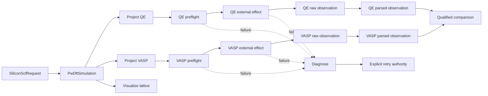

# Silicon SCF cross-calculator colored-Petri-net workflow

**Status:** Proposed application-specific CPN fragment; runtime binding is blocked on accepted `projectkoios-cpn` and `projectkoios-workflow` contracts

## Purpose

Replace script-owned orchestration of the maintained silicon SCF comparison with an application-specific colored Petri net. The net owns dependency and concurrency semantics. Calculator adapters continue to own QE and VASP projection, resource preflight, staging, execution, and parsing.

The existing `run.py` files are not workflow engines. Their eventual role is limited to constructing an initial request, selecting an execution profile, invoking the accepted workflow adapter, and displaying identified outcomes.

## Ownership

- `projectkoios-cpn` owns generic net definitions, markings, enablement, binding selection, firing, composition, and visualization.
- `projectkoios-workflow` owns workflow runs, effect coordination, persistence boundaries, audit, and replay.
- This repository owns the silicon-specific token colors, CPN fragment, calculator projections, scientific comparison rules, and provenance bindings.
- QE and VASP executables remain external effects. No CPN transition executes a calculator directly.

## Token colors

| Token color | Meaning |
|---|---|
| `SiliconScfRequest` | Identified request for the two-atom silicon SCF comparison |
| `PwDftSimulation` | Shared calculator-neutral cell and scientific settings |
| `QeInputProjection` | Qualified QE input model and unresolved requirements |
| `VaspInputProjection` | Qualified VASP input models and unresolved requirements |
| `ResolvedCalculatorResources` | Verified executable and pseudopotential identities for one calculator |
| `CalculatorExecutionRequest` | Fully staged, bounded external-effect request |
| `CalculatorExecutionRecord` | Durable launch, completion, timeout, or failure evidence |
| `RawScfObservation` | Calculator-native output values retained without cross-code reinterpretation |
| `ParsedScfObservation` | Typed observations derived from one raw output artifact |
| `FailureDiagnosis` | Evidence-backed failure classification and proposed minimal correction |
| `RetryAuthorization` | Explicit bounded authority to perform one corrected retry |
| `CrossCalculatorComparison` | Qualified comparison derived only after both observations exist |
| `LatticeVisualization` | Interactive view derived from the shared unit-cell token |

## Places

| Place | Token color | Role |
|---|---|---|
| `requested` | `SiliconScfRequest` | Initial request |
| `shared_simulation_ready` | `PwDftSimulation` | Single scientific source for both calculators |
| `qe_projection_ready` | `QeInputProjection` | QE branch input |
| `vasp_projection_ready` | `VaspInputProjection` | VASP branch input |
| `qe_resources_ready` | `ResolvedCalculatorResources` | QE preflight success |
| `vasp_resources_ready` | `ResolvedCalculatorResources` | VASP preflight success |
| `qe_execution_requested` | `CalculatorExecutionRequest` | QE external effect awaiting output |
| `vasp_execution_requested` | `CalculatorExecutionRequest` | VASP external effect awaiting output |
| `qe_execution_recorded` | `CalculatorExecutionRecord` | Durable QE execution evidence |
| `vasp_execution_recorded` | `CalculatorExecutionRecord` | Durable VASP execution evidence |
| `qe_raw_observation` | `RawScfObservation` | Preserved QE output |
| `vasp_raw_observation` | `RawScfObservation` | Preserved VASP output |
| `qe_observation_ready` | `ParsedScfObservation` | Parsed QE result |
| `vasp_observation_ready` | `ParsedScfObservation` | Parsed VASP result |
| `failure_pending_diagnosis` | `CalculatorExecutionRecord` | Failed preflight or execution evidence |
| `diagnosis_ready` | `FailureDiagnosis` | Proposed correction without retry authority |
| `retry_authorized` | `RetryAuthorization` | Bounded retry authority |
| `comparison_ready` | `CrossCalculatorComparison` | Joined qualified result |
| `visualization_ready` | `LatticeVisualization` | Independent structure view |

## Transitions

| Transition | Consumes or reads | Produces | Effect status |
|---|---|---|---|
| `construct_shared_simulation` | `requested` | `shared_simulation_ready` | Pure |
| `project_qe_input` | Reads `shared_simulation_ready` | `qe_projection_ready` | Pure |
| `project_vasp_input` | Reads `shared_simulation_ready` | `vasp_projection_ready` | Pure |
| `render_lattice_visualization` | Reads `shared_simulation_ready` | `visualization_ready` | Artifact-producing adapter action |
| `preflight_qe` | `qe_projection_ready` | `qe_resources_ready` or `failure_pending_diagnosis` | Repository and filesystem effect |
| `preflight_vasp` | `vasp_projection_ready` | `vasp_resources_ready` or `failure_pending_diagnosis` | Repository and filesystem effect |
| `request_qe_execution` | `qe_projection_ready` and `qe_resources_ready` | `qe_execution_requested` | Pure request construction |
| `request_vasp_execution` | `vasp_projection_ready` and `vasp_resources_ready` | `vasp_execution_requested` | Pure request construction |
| `record_qe_external_output` | `qe_execution_requested` plus external output binding | `qe_execution_recorded` and either `qe_raw_observation` or `failure_pending_diagnosis` | External-output binding |
| `record_vasp_external_output` | `vasp_execution_requested` plus external output binding | `vasp_execution_recorded` and either `vasp_raw_observation` or `failure_pending_diagnosis` | External-output binding |
| `parse_qe_observation` | Reads `qe_raw_observation` | `qe_observation_ready` | Pure bounded parsing |
| `parse_vasp_observation` | Reads `vasp_raw_observation` | `vasp_observation_ready` | Pure bounded parsing |
| `diagnose_failure` | Reads `failure_pending_diagnosis` | `diagnosis_ready` | Pure classification where evidence is sufficient |
| `authorize_retry` | `diagnosis_ready` plus external authority evidence | `retry_authorized` | Human or owning-policy decision boundary |
| `prepare_corrected_retry` | `diagnosis_ready` and `retry_authorized` | Calculator-specific projection or execution request | Pure bounded correction projection |
| `compare_observations` | Reads `qe_observation_ready` and `vasp_observation_ready` | `comparison_ready` | Pure qualified comparison |

## Concurrency and joining

After `construct_shared_simulation`, QE projection, VASP projection, and lattice visualization are independently enabled. QE and VASP preflight and execution proceed independently. A failure in one branch does not erase or overwrite the successful observation from the other branch.

`compare_observations` is enabled only when both parsed observation tokens exist. It never consumes raw observations, so replay and alternative comparison policies can reuse the same calculator evidence.

## Calculator mapping evidence

VASP `IBRION` and QE workflow alignments are projection evidence, not transition identities. Static SCF projection may use VASP `IBRION=-1` and QE `calculation='scf'`, but phonons and transition paths require separate workflows and executables.

- QE phonons use `ph.x` after a qualified SCF reference.
- QE NEB uses `neb.x` and `&PATH`.
- VASP `IBRION=44` is the improved dimer method and must not be routed to the NEB transition.
- QE 7.5 does not expose `ion_dynamics='cg'`; a VASP conjugate-gradient relaxation cannot be labeled algorithm-equivalent to QE BFGS, damped dynamics, or FIRE.

## Failure and retry rules

1. Every preflight or execution failure produces durable evidence before control returns.
2. Diagnosis does not mutate the failed request or authorize another launch.
3. A correction produces a new identified projection or request linked to the failed attempt.
4. Retry requires an explicit bounded policy or decision token.
5. Retry counts and allowed corrections remain finite and declared by execution policy.
6. Exhaustion produces a terminal failed workflow outcome without deleting successful branch evidence.

## Scientific claim boundary

The comparison transition may convert units and report calculator-native convergence evidence. It may report a separately qualified pseudopotential reference adjustment. It must not claim absolute total-energy equivalence across different pseudopotential conventions.

A stronger cross-code numerical comparison requires a shared strain-series workflow and relative-energy observations. Phonon, NEB, relaxation, and molecular-dynamics workflows are separate CPN fragments rather than alternate values hidden in the SCF fragment.

## Implementation gate

This repository can maintain this scientific CPN specification and deterministic fixtures now. Runtime imports remain blocked until `projectkoios-cpn` publishes accepted kernel contracts and `projectkoios-workflow` publishes an accepted adapter/effect/runtime contract. The temporary `projectkoios.workflow.petrinet.colored` shadow may support transfer fixtures but must not become a durable runtime dependency.
