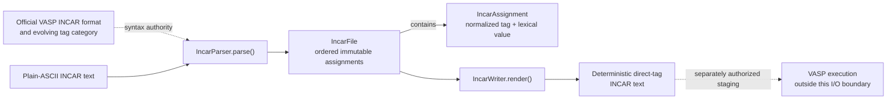

# INCAR I/O architecture

## Boundary

`IncarParser` validates bounded generic syntax but does not freeze the evolving VASP tag inventory, apply defaults, resolve duplicate tags, or determine tag compatibility. `IncarFile` and `IncarAssignment` are immutable data. `IncarWriter` normalizes syntax without filesystem access. Calculator staging, execution, OUTCAR inspection, numerical verification, and scientific validation remain separate operations.
