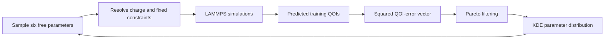

# Ragasa et al. (2019): MgO potential optimization

E. J. Ragasa, C. J. O'Brien, R. G. Hennig, S. M. Foiles, and S. R. Phillpot,
“Multi-objective optimization of interatomic potentials with application to
MgO,” *Modelling and Simulation in Materials Science and Engineering* **27**,
074007 (2019).

- DOI: `10.1088/1361-651X/ab28d9`
- [Publisher article](https://iopscience.iop.org/article/10.1088/1361-651X/ab28d9)
- [Accepted-manuscript PDF](https://iopscience.iop.org/article/10.1088/1361-651X/ab28d9/ampdf)

## Relationship to the reconstruction

This paper describes the scientific workflow implemented by the historical
PyFlamestk/PyPosPack MgO Buckingham examples. It is authoritative evidence for
method intent and scientific terminology. Exact behavior of a pinned source
revision remains governed by `sources/`, vendored-file identities, and
conformance tests; publication-level sample counts or algorithms must not be
silently imposed on code when a pinned implementation differs.

## Four-stage process

The paper presents potential development as four stages:

1. identify structures, training properties, and reference values from
   experiment or higher-fidelity calculations;
2. generate an ensemble of rational potential parameterizations through Pareto
   optimization;
3. analyze the ensemble in parameter and QOI-error spaces; and
4. down-select and test final potentials on properties outside the fitting set.

## MgO reference-QOI path

The reported MgO fitting references were calculated with VASP using PBE-GGA.
The ten training QOIs comprise the rock-salt lattice parameter; three elastic
constants plus bulk and shear moduli; anion Frenkel, cation
Frenkel, and Schottky defect formation energies; and the (100) surface energy.
The publication reports backend-specific unit cells, supercells, k-point meshes,
and an 800 eV plane-wave cutoff.

These VASP calculations occur outside the candidate optimization loop. Their
qualified outputs form the reference-QOI database consumed by objective-error
calculation.

## MgO candidate path

The candidate model is a Coulomb-plus-Buckingham interatomic potential evaluated
with LAMMPS. The paper leaves six free parameters:

- magnesium charge;
- Mg–O Buckingham `A` and `rho`;
- O–O Buckingham `A`, `rho`, and `C`.

Oxygen charge is dependent through charge neutrality. Mg–Mg short-range terms
and the Mg–O dispersion term are fixed. The initial vague prior is a bounded
independent uniform distribution for each free parameter.

Randomly generated potentials that fail forward evaluation are rejected as
identified failed candidates. Viable candidates are compared in the
multi-dimensional vector of squared QOI errors. Dominated candidates are
removed; a KDE estimated from retained Pareto-efficient parameters guides later
sampling. Distribution convergence is discussed using Kullback–Leibler
divergence.

The paper reports an initial population of 10,000 viable parameterizations, 955
initial Pareto-efficient potentials, ten KDE refinements, and a final ensemble
of 7,557 Pareto-efficient potentials. These are publication claims, not default
runtime constants for every historical example.

## Results handling and down-selection

The primary optimization result is an ensemble approximating the Pareto
hypersurface, not one weighted-sum optimum. Preference-dependent down-selection
is deliberately postponed until after the ensemble is constructed. The paper
then illustrates selecting ten potentials by an unweighted normalized squared
error measure.

Final testing uses properties excluded from fitting: a zone-center optical
phonon frequency and linear thermal expansion. Those checks use additional
forward calculations and comparisons with DFT or experiment. They are
validation evidence and remain distinct from training-QOI evaluation.

## Architectural consequences

- The optimizer owns uniform/KDE proposal, Pareto selection, iteration, and
  convergence state.
- The candidate forward-function engine owns LAMMPS simulation planning,
  execution evidence, and predicted QOI calculation.
- The reference path owns VASP/DFT provenance and reference-QOI qualification.
- QOI definitions and normalized observations are reusable across candidate and
  reference paths; backend-specific simulation plans are not interchangeable.
- The results handler calculates one error per training QOI, preserves the full
  vector, and sends it to the optimizer; the optimizer performs Pareto selection
  and updates the proposal distribution.
- Preference-based final selection and out-of-training testing occur after
  Pareto-ensemble construction.
