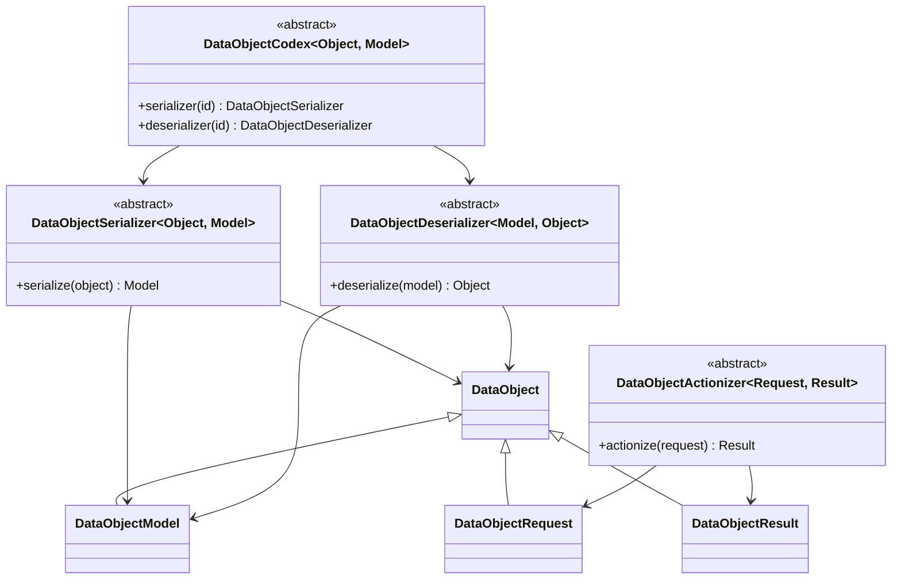

# Lightweight tool base classes

`tools/base.py` provides nominal, runtime-enforced base classes without a
registry, service locator, persistence layer, or serialization framework.

## Use of the base classes

The data roles are frozen slotted dataclasses. Every concrete `DataObject`,
`DataObjectModel`, `DataObjectRequest`, and `DataObjectResult` subclass must be
directly declared with `@dataclass(frozen=True, slots=True)`. Inheriting from a
frozen dataclass does not by itself guarantee that a new subclass is immutable.
Mutable builders, caches, sessions, and other working state do not inherit from
`DataObject`.

Use each role only for its stated boundary:

- `DataObject` marks immutable, effect-free represented state.
- `DataObjectModel` is a model representation produced or consumed by a codec.
- `DataObjectRequest` and `DataObjectResult` close an actionizer invocation.
- `DataObjectActionizer` owns an externally selected operation; actionizers are
  never stored on their data objects.
- `DataObjectSerializer` maps a data object to a model, and
  `DataObjectDeserializer` reconstructs the data object from a model.
- `DataObjectCodex` explicitly selects among compatible serializers and
  deserializers; it is not a global registry or service locator.
- `DataObjectValidator`, `DataObjectVerifier`, and
  `DataObjectUncertaintyQualification` distinguish those evidence activities.
  Unit tests test their implementations but do not constitute validation,
  verification, or uncertainty qualification.

Behavioral roles use `ABC` and `abstractmethod`, so missing implementations are
rejected when a concrete class is instantiated and `isinstance` can enforce
nominal membership at runtime.

## Base-class change control

These base classes are a deliberately small, closed architectural vocabulary.
Do not introduce another shared base class, intermediate inheritance layer, or
new base-class responsibility as an implementation convenience. If a new base
class appears necessary, freeze that implementation work and hold an explicit
architecture discussion first. The discussion must establish the missing
invariant or runtime contract, explain why composition or an existing role is
insufficient, and identify the affected callers and tests before implementation
resumes.
