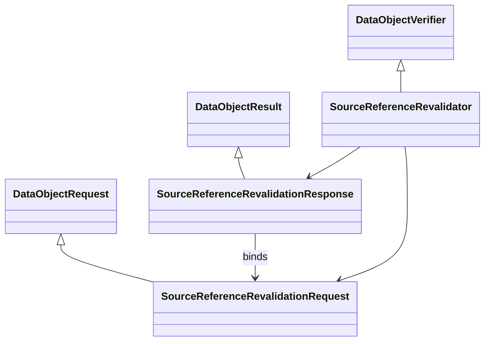

# Source-reference revalidation actionizer

`tools/sources/revalidation.py` owns the typed tool boundary, while
`tools/revalidate_source_reference.py` contains only CLI parsing, report-document
projection, output, and exit-code handling:

`SourceReferenceRevalidationRequest` carries the repository root, component,
explicit local checkout, and optional requested revision. It rejects component
path traversal before filesystem access.

`SourceReferenceRevalidator.actionize` reads only declared metadata and committed
Git objects. It returns an immutable `SourceReferenceRevalidationResponse` with
typed repository, revision, tree, license, selected-file, and example-tree
comparisons. `SourceReferenceRevalidationReportSerializer` maps that result to a
`SourceReferenceRevalidationReportModel`; only the CLI projects the model into
its deterministic JSON document.

The response never authorizes a pin change. A differing candidate remains
`candidate_identity_differs_not_accepted` even when the command-line adapter is
asked to emit a candidate report.
