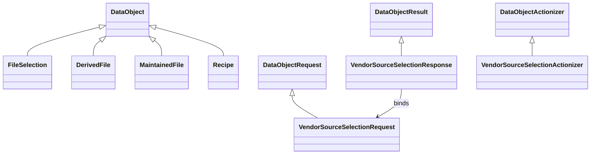

# Source-selection vendoring actionizer

`tools/vendors/source_selection.py` classifies its recipe records as immutable
`DataObject` values and owns the typed operation boundary.
`tools/vendor_source_selection.py` is only the CLI adapter:

`VendorSourceSelectionRequest` carries the repository root, recipe, explicit
checkout, and a closed `check` or `sync` mode. The actionizer continues to read
committed Git objects, enforce declared source authorization, contain destination
paths, and write synchronized files atomically.

A successful response has exactly one disposition:

- `selection_matches`; or
- `selection_synchronized`.

Invalid recipes, unauthorized source paths, identity failures, and stale checked
selections raise `VendoringError`; they are not fabricated into successful
results. The CLI invokes the actionizer directly; no parallel compatibility
function bypasses the request/result boundary.
